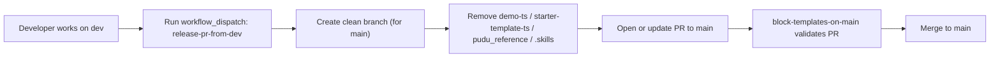

# RobotX CRM

<p align="center">
  <strong>Next.js + Jumbo UI based CRM workspace for RobotX</strong><br/>
  <sub>Development playground + release-safe flow to keep <code>main</code> clean.</sub>
</p>

<p align="center">
  
  
  
  
  
</p>

---

## Overview

This repository is currently organized as a **workspace-style container** for CRM development and references:

- `demo-ts/`: primary TypeScript Jumbo Next.js app (recommended working app)
- `demo/`: JavaScript Jumbo Next.js variant
- `starter-template-ts/`: lighter TypeScript starter template
- `pudu_reference/`: static reference snapshots (Product/Customer Center assets)
- `.skills/`: local Codex/Jumbo offline documentation helpers

At the moment, there is no single root app build. Each app runs independently from its own folder.

---

## Repo Layout

```text
robotx-CRM/
├─ .github/workflows/
│  ├─ block-templates-on-main.yml
│  └─ release-pr-from-dev.yml
├─ .skills/
├─ demo/
├─ demo-ts/
├─ starter-template-ts/
├─ pudu_reference/
└─ AGENTS.md
```

---

## Tech Stack Snapshot

The active app templates (`demo-ts`, `demo`, `starter-template-ts`) are built on:

- Next.js `15.1.6` (App Router)
- React `19`
- TypeScript `5` (TS variants)
- MUI `6` + Emotion
- NextAuth `4`
- Form and validation: `react-hook-form` + `yup`
- Charts/editors/widgets: Recharts, MUI X, TipTap, CKEditor, DnD Kit

---

## Quick Start

### 1) Choose your app directory

Recommended:

```bash
cd demo-ts
```

Alternatives:

```bash
cd demo
# or
cd starter-template-ts
```

### 2) Install dependencies

```bash
npm install
```

### 3) Start dev server

```bash
npm run dev
```

Then open [http://localhost:3000](http://localhost:3000).

---

## Common Scripts (per app)

Run these inside `demo-ts/`, `demo/`, or `starter-template-ts/`:

```bash
npm run dev        # local dev (turbopack)
npm run build      # production build
npm run start      # start built app
npm run lint       # next lint
npm run format     # prettier check
npm run format:fix # prettier write
```

---

## Branching and Release Flow

This repo uses a **safe release pattern**:

- `dev` can contain templates and local docs (`demo-ts/`, `pudu_reference/`, `starter-template-ts/`, `.skills/`)
- `main` should stay clean for production-facing content

### Guardrail Workflow

`/.github/workflows/block-templates-on-main.yml`

- Trigger: PR targeting `main`
- Fails PR if forbidden paths are present:
  - `demo-ts/`
  - `pudu_reference/`
  - `starter-template-ts/`
  - `.skills/`

### One-Click Release PR Workflow

`/.github/workflows/release-pr-from-dev.yml`

- Trigger: manual (`workflow_dispatch`)
- Builds a release branch from `dev`
- Removes forbidden paths
- Creates/updates PR into `main`

> Note: If your org restricts PR creation by `GITHUB_TOKEN`, set repository secret `PR_BOT_TOKEN` (PAT with `repo` scope).

---

## Release Automation (Visual)



---

## Conventions

- Keep product/runtime-relevant code in the app folders.
- Keep large references and local AI docs out of `main`.
- Keep `AGENTS.md` as team-level collaboration guidance.
- Prefer `demo-ts/` for TypeScript-first development.

---

## Roadmap Ideas

- Add a root `Makefile` or task runner for unified commands across app folders.
- Add smoke tests per app and run them in PR checks.
- Gradually consolidate to one canonical app (`demo-ts`) when ready.

---

## License

Internal project. Add an explicit license file if this repository will be shared externally.
